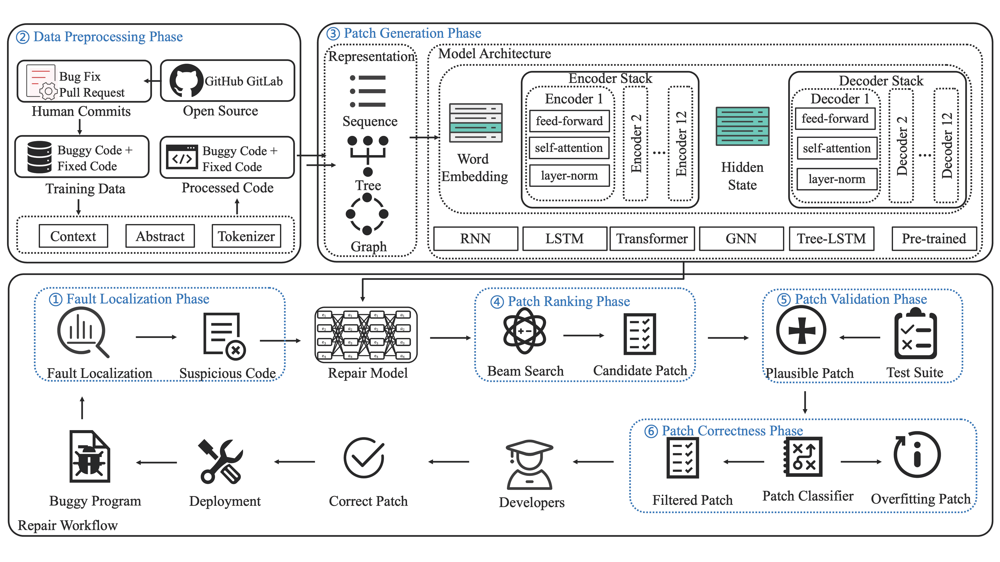

# Awesome Learning-based APR
[](https://awesome.re)
[](https://arxiv.org/abs/2301.03270)

 

🔥🔥🔥[2024-05-03] We have released a new paper about LLM4APR, [A Systematic Literature Review on Large Language Models for Automated Program Repair](https://arxiv.org/abs/2405.01466). Please refer to <a href="https://arxiv.org/abs/2405.01466"></a> and <a href="https://github.com/iSEngLab/AwesomeLLM4APR/"></a>


A collection of academic publications, methodology, metrics and datasets on the subject of **automated program repair enhanced with deep/machine learning techniques**.


We welcome all researchers to contribute to this repository and further contribute to the knowledge of the learning-based APR field.
Please feel free to contact us if you have any related references by Github issue or pull request. 

## Citation

Please read and cite our paper: [](https://arxiv.org/abs/2301.03270)

```
@article{zhang2023survey,
  title = {A Survey of Learning-Based Automated Program Repair},
  author = {Zhang, Quanjun and Fang, Chunrong and Ma, Yuxiang and Sun, Weisong and Chen, Zhenyu},
  journal={ACM Transactions on Software Engineering and Methodology},
  volume={33},
  number={2},
  pages={1--69},
  year={2023},
  publisher={ACM New York, NY}
}
```

----------

## A Framework of Deep Learning-based APR

----------

## Collected Papers
| **Paper Title** | **Venue** | **Year** | **Code Available**|
| --------------- | ---- | ---- | --- |
| [Neural Transfer Learning for Repairing Security Vulnerabilities in C Code](https://ieeexplore.ieee.org/abstract/document/9699412/) | _TSE_ | 2022 | [yes](https://github.com/SteveKommrusch/VRepair) |
| [Vulrepair: A T5-based Automated Software Vulnerability Repair](https://dl.acm.org/doi/abs/10.1145/3540250.3549098) | _ESEC/FSE_ | 2022 |[yes](https://github.com/awsm-research/VulRepair)|
| [Seqtrans: Automatic Vulnerability Fix Via Sequence to Sequence Learning](https://ieeexplore.ieee.org/abstract/document/9729554/) | _TSE_ | 2022 |[yes](https://github.com/chijianlei/SeqTrans)|
| [Learning to Repair Software Vulnerabilities with Generative Adversarial Networks](https://proceedings.neurips.cc/paper/2018/hash/68abef8ee1ac9b664a90b0bbaff4f770-Abstract.html) | _NeurIPS_ | 2018 | no |
| [Repairing Security Vulnerabilities Using Pre-trained Programming Language Models](https://ieeexplore.ieee.org/abstract/document/9833850/) | _DSNW_ | 2022 | no |
| [Spvf: Security Property Assisted Vulnerability Fixing Via Attention-based Models](https://link.springer.com/article/10.1007/s10664-022-10216-4) | _ESE_ | 2022 | no |
| [Vurle: Automatic Vulnerability Detection and Repair by Learning from Examples](https://link.springer.com/chapter/10.1007/978-3-319-66399-9_13) | _ESORICS_ | 2017 | no |
| [Synshine: Improved Fixing of Syntax Errors](https://ieeexplore.ieee.org/abstract/document/9913705/) | _TSE_ | 2022 |[yes](https://zenodo.org/record/4572390#.Y4CY8xRByUk)|
| [Deepfix: Fixing Common C Language Errors by Deep Learning](https://ojs.aaai.org/index.php/AAAI/article/view/10742) | _AAAI_ | 2017 | no |
| [Break-it-fix-it: Unsupervised Learning for Program Repair](http://proceedings.mlr.press/v139/yasunaga21a.html) | _ICML_ | 2021 | [yes](https://github.com/michiyasunaga/bifi)|
| [Tfix: Learning to Fix Coding Errors with a Text-to-text Transformer](http://proceedings.mlr.press/v139/berabi21a.html) | _ICML_ | 2021 |[yes](https://github.com/eth-sri/TFix)|
| [Deepdelta: Learning to Repair Compilation Errors](https://dl.acm.org/doi/abs/10.1145/3338906.3340455) | _ESE/FSE_ | 2019 | no |
| [Syntax and Sensibility: Using Language Models to Detect and Correct Syntax Errors](https://ieeexplore.ieee.org/abstract/document/8330219/) | _SANER_ | 2018 | no |
| [Learning Lenient Parsing \& Typing Via Indirect Supervision](https://link.springer.com/article/10.1007/s10664-021-09942-y) | _ESE_ | 2021 | [yes](https://doi.org/10.5281/zenodo.3374019)|
| [Deep Reinforcement Learning for Syntactic Error Repair in Student Programs](https://ojs.aaai.org/index.php/AAAI/article/view/3882) | _AAAI_ | 2019 | [yes](https://bitbucket.org/iiscseal/rlassist)|
| [Neuro-symbolic Program Corrector for Introductory Programming Assignments](https://dl.acm.org/doi/abs/10.1145/3180155.3180219) | _ICSE_ | 2018 | no |
| [Samplefix: Learning to Generate Functionally Diverse Fixes](https://link.springer.com/chapter/10.1007/978-3-030-93733-1_8) | _ECML_ | 2021 | no |
| [Ggf: A graph-based method for programming language syntax error correction](https://dl.acm.org/doi/abs/10.1145/3387904.3389252) | _ICPC_ | 2020 | no |
| [Compilation Error Repair: For the Student Programs, from the Student Programs](https://dl.acm.org/doi/abs/10.1145/3183377.3183383) | _ICSE-SEET_ | 2018 | no|
| [Search, Align, and Repair: Data-driven Feedback Generation for Introductory Programming Exercises](https://dl.acm.org/doi/abs/10.1145/3192366.3192384) | _PLDI_ | 2018 | no|
| [Dynamic Neural Program Embeddings for Program Repair](https://arxiv.org/abs/1711.07163) | _ICLR_ | 2018 |[yes](https://github.com/keowang/dynamic-program-embedding)|
| [Repairing Bugs in Python Assignments Using Large Language Models](https://arxiv.org/abs/2209.14876) | _arxiv_ | 2021 | no |
| [Verifix: Verified Repair of Programming Assignments](https://dl.acm.org/doi/abs/10.1145/3510418) | _TOSEM_ | 2022 | [yes](https://github.com/zhiyufan/Verifix)|
| [Generating Concise Patches for Newly Released Programming Assignments](https://ieeexplore.ieee.org/abstract/document/9720157/) | _TSE_ | 2022 | no |
| [Automated correction for syntax errors in programming assignments using recurrent neural networks](https://arxiv.org/abs/1603.06129) | _arxiv_ | 2016 | no |
| [Improving Automatically Generated Code from Codex Via Automated Program Repair](https://arxiv.org/abs/2205.10583) | _arxiv_ | 2022 | no |
| [Synthesize, Execute and Debug: Learning to Repair for Neural Program Synthesis](https://proceedings.neurips.cc/paper/2020/hash/cd0f74b5955dc87fd0605745c4b49ee8-Abstract.html) | _NeurIPS_ | 2020 | no |
| [Detecting and Fixing Nonidiomatic Snippets in Python Source Code with Deep Learning](https://link.springer.com/chapter/10.1007/978-3-030-82193-7_9) | _ISC_ | 2021 | no |
| [Getafix: Learning to Fix Bugs Automatically](https://dl.acm.org/doi/abs/10.1145/3360585) | _OOPSLA_ | 2019 | no |
| [A Software-repair Robot Based on Continual Learning](https://ieeexplore.ieee.org/abstract/document/9393494/) | _IEEE Software_ | 2021 | [yes](https://github.com/repairnator/open-science-repairnator/tree/master/data/2020-r-hero) |
| [Self-supervised Bug Detection and Repair](https://proceedings.neurips.cc/paper/2021/hash/ea96efc03b9a050d895110db8c4af057-Abstract.html) | _NeurIPS_ | 2021 | [yes](https://github.com/microsoft/neurips21-self-supervised-bug-detection-and-repair) |
| [Deepdebug: Fixing Python Bugs Using Stack Traces, Backtranslation, and Code Skeletons](https://arxiv.org/abs/2105.09352) | _arxiv_ | 2021 | no |
| [Generating Bug-fixes Using Pretrained Transformers](https://dl.acm.org/doi/abs/10.1145/3460945.3464951) | _MAPS_ | 2021 | no |
| [Global Relational Models of Source Code](https://research.google/pubs/pub49316/) | _ICLR_ | 2019 | [yes](https://github.com/VHellendoorn/ICLR20-Great) |
| [Fix Bugs with Transformer through a Neural-symbolic Edit Grammar](https://arxiv.org/abs/2204.06643) | _arxiv_ | 2022 | no |
| [Grammar-based Patches Generation for Automated Program Repair](https://aclanthology.org/2021.findings-acl.111.pdf) | _ACL-IJCNLP_ | 2021 | no |
| [Leveraging Causal Inference for Explainable Automatic Program Repair](https://ieeexplore.ieee.org/abstract/document/9892168/) | _arxiv_ | 2022 | no |
| [Codebert: A Pre-trained Model for Programming and Natural Languages](https://arxiv.org/abs/2002.08155) | _EMNLP_ | 2020 | [yes](https://github.com/microsoft/CodeBERT) |
| [Codet5: Identifier-aware Unified Pre-trained Encoder-decoder Models for Code Understanding and Generation](https://arxiv.org/abs/2109.00859) | _EMNLP_ | 2021 | [yes](https://github.com/salesforce/CodeT5) |
| [Graphcodebert: Pre-training Code Representations with Data Flow](https://arxiv.org/abs/2009.08366) | _ICLR_ | 2021 | [yes](https://github.com/microsoft/CodeBERT) |
| [Using Transfer Learning for Code-related Tasks](https://ieeexplore.ieee.org/abstract/document/9797060/) | _TSE_ | 2022 | [yes](https://github.com/antonio-mastropaolo/TransferLearning4Code) |
| [Spt-code: Sequence-to-sequence Pre-training for Learning the Representation of Source Code](https://arxiv.org/abs/2201.01549) | _ICSE_ | 2022 | [yes](https://github.com/NougatCA/SPT-Code) |
| [Circle: Continual Repair across Programming Languages](https://dl.acm.org/doi/abs/10.1145/3533767.3534219) | _ISSTA_ | 2022 | [yes](https://github.com/2022CIRCLE/CIRCLE) |
| [On Multi-modal Learning of Editing Source Code](https://ieeexplore.ieee.org/abstract/document/9678559/) | _ASE_ | 2021 | no |
| [Patch Generation with Language Models: Feasibility and Scaling Behavior](https://openreview.net/forum?id=rHlzJh_b1-5) | _ICLR-DL4C_ | 2022 | no |
| [Can We Learn from Developer Mistakes? Learning to Localize and Repair Real Bugs from Real Bug Fixes](https://arxiv.org/abs/2207.00301) | _arxiv_ | 2022 | [yes](https://github.com/cedricrupb/nbfbaselines) |
| [Coditt5: Pretraining for Source Code and Natural Language Editing](https://dl.acm.org/doi/abs/10.1145/3551349.3556955) | _ASE_ | 2022 | [yes](https://github.com/EngineeringSoftware/CoditT5) |
| [Applying Codebert for Automated Program Repair of Java Simple Bugs](https://ieeexplore.ieee.org/abstract/document/9463106/) | _MSR_ | 2021 | [yes](https://github.com/EhsanMashhadi/MSR2021-ProgramRepair) |
| [Towards Javascript Program Repair with Generative Pre-trained Transformer (gpt-2)](https://dl.acm.org/doi/abs/10.1145/3524459.3527350) | _APR_ | 2022 | [yes](https://github.com/RGAI-USZ/APR22-JS-GPT) |
| [Can Openai's Codex Fix Bugs? An Evaluation on Quixbugs](https://dl.acm.org/doi/abs/10.1145/3524459.3527351) | _APR_ | 2022 | no |
| [Glad: Neural Predicate Synthesis to Repair Omission Faults](https://arxiv.org/abs/2204.06771) | _arxiv_ | 2022 | no |
| [Less Training, More Repairing Please: Revisiting Automated Program Repair Via Zero-shot Learning](https://dl.acm.org/doi/abs/10.1145/3540250.3549101) | _ESEC/FSE_ | 2022 | no |
| [Automatic Patch Generation by Learning Correct Code](https://dl.acm.org/doi/abs/10.1145/2837614.2837617) | _POPL_ | 2016 | no |
| [Program Repair with Repeated Learning](https://ieeexplore.ieee.org/abstract/document/9749899/) | _TSE_ | 2022 | no |
| [Improving Fault Localization and Program Repair with Deep Semantic Features and Transferred Knowledge](https://dl.acm.org/doi/abs/10.1145/3510003.3510147) | _ICSE_ | 2022 | [yes](https://github.com/mxx1219/TRANSFER) |
| [Improving Search-based Automatic Program Repair with Neural Machine Translation](https://ieeexplore.ieee.org/abstract/document/9749095/) | _IEEE Access_ | 2022 | no |
| [Siturepair: Incorporating Machine-learning Fault Class Prediction to Inform Situational Multiple Fault Automatic Program Repair](https://www.sciencedirect.com/science/article/pii/S1874548222000178) | _IJCIP_ | 2022 | no |
| [Dear: A Novel Deep Learning-based Approach for Automated Program Repair](https://dl.acm.org/doi/abs/10.1145/3510003.3510177) | _ICSE_ | 2022 | [yes](https://github.com/AutomatedProgramRepair-2021/dear-auto-fix) |
| [Graphix: A Pre-trained Graph Edit Model for Automated Program Repair](https://openreview.net/forum?id=uB12zutkXJR) | __ | 2021 | no |
| [Can We Automatically Fix Bugs by Learning Edit Operations?](https://ieeexplore.ieee.org/abstract/document/9825852/) | _SANER_ | 2022 | [yes](https://github.com/WM-SEMERU/hephaestus) |
| [Language Models Can Prioritize Patches for Practical Program Patching](https://dl.acm.org/doi/abs/10.1145/3524459.3527343) | _APR_ | 2022 | no |
| [Predicting Patch Correctness Based on the Similarity of Failing Test Cases](https://dl.acm.org/doi/abs/10.1145/3511096) | _TOSEM_ | 2022 | [yes](https://github.com/HaoyeTianCoder/BATS) |
| [Defect Identification, Categorization, and Repair: Better Together](https://arxiv.org/abs/2204.04856) | _arxiv_ | 2022 | [yes](https://zenodo.org/record/5353354#.Y4CVdhRByUl) |
| [Selfapr: Self-supervised Program Repair with Test Execution Diagnostics](https://arxiv.org/abs/2203.12755) | _ASE_ | 2022 | [yes](https://github.com/ASSERT-KTH/SelfAPR) |
| [Crex: Predicting Patch Correctness in Automated Repair of C Programs through Transfer Learning of Execution Semantics](https://www.sciencedirect.com/science/article/pii/S0950584922001562) | _IST_ | 2022 | [yes](https://github.com/1993ryan/crex) |
| [Bug-transformer: Automated Program Repair Using Attention-based Deep Neural Network](https://www.worldscientific.com/doi/abs/10.1142/S0218126622502103) | _JCSC_ | 2022 | no |
| [Katana: Dual Slicing-based Context for Learning Bug Fixes](https://arxiv.org/abs/2205.00180) | _arxiv_ | 2022 | no |
| [Oapr-homl'1: Optimal Automated Program Repair Approach Based on Hybrid Improved Grasshopper Optimization and Opposition Learning Based Artificial Neural Network](https://www.koreascience.or.kr/article/JAKO202213341729825.page) | _IJCSDS_ | 2022 | no |
| [Repair Is Nearly Generation: Multilingual Program Repair with Llms](https://arxiv.org/abs/2208.11640) | _arxiv_ | 2022 | no |
| [Practical Program Repair in the Era of Large Pre-trained Language Models](https://arxiv.org/abs/2210.14179) | _arxiv_ | 2022 | no |
| [Context-aware Code Change Embedding for Better Patch Correctness Assessment](https://dl.acm.org/doi/abs/10.1145/3505247) | _TOSEM_ | 2022 | [yes](https://github.com/Ringbo/Cache) |
| [Attention: Not Just Another Dataset for Patch-correctness Checking](https://arxiv.org/abs/2207.06590) | _arxiv_ | 2022 | [yes](https://github.com/anonymous0903/patch_correctness) |
| [Is This Change the Answer to That Problem? Correlating Descriptions of Bug and Code Changes for Evaluating Patch Correctness](https://arxiv.org/abs/2208.04125) | _ASE_ | 2022 | [yes](https://github.com/Trustworthy-Software/Quatrain) |
| [Patch Correctness Assessment in Automated Program Repair Based on the Impact of Patches on Production and Test Code](https://dl.acm.org/doi/abs/10.1145/3533767.3534368) | _ISSTA_ | 2022 | [yes](https://github.com/ali-ghanbari/shibboleth) |
| [The Best of Both Worlds: Combining Learned Embeddings with Engineered Features for Accurate Prediction of Correct Patches](https://dl.acm.org/doi/abs/10.1145/3576039) | _TOSEM_ | 2022 | [yes](https://github.com/HaoyeTianCoder/Panther) |
| [M3v: Multi-modal Multi-view Context Embedding for Repair Operator Prediction](https://ieeexplore.ieee.org/abstract/document/9741261/) | _CGO_ | 2022 | no |
| [Identifying Incorrect Patches in Program Repair Based on Meaning of Source Code](https://ieeexplore.ieee.org/abstract/document/9690887/) | _IEEE Access_ | 2022 | [yes](https://github.com/ngocpq/MIPI) |
| [Towards Boosting Patch Execution On-the-fly](https://dl.acm.org/doi/abs/10.1145/3510003.3510117) | _ICSE_ | 2022 | no |
| [Cure: Code-aware Neural Machine Translation for Automatic Program Repair](https://ieeexplore.ieee.org/abstract/document/9401997/) | _ICSE_ | 2021 | no |
| [A Syntax-guided Edit Decoder for Neural Program Repair](https://dl.acm.org/doi/abs/10.1145/3468264.3468544) | _ESEC/FSE_ | 2021 | [yes](https://github.com/pkuzqh/Recoder) |
| [Sequencer: Sequence-to-sequence Learning for End-to-end Program Repair](https://ieeexplore.ieee.org/abstract/document/8827954/) | _TSE_ | 2019 | [yes](https://github.com/kth/SequenceR) |
| [A Controlled Experiment of Different Code Representations for Learning-based Program Repair](https://linkspringer.53yu.com/article/10.1007/s10664-022-10223-5) | _ESE_ | 2022 | [yes](https://github.com/annon-reptory/reptory) |
| [Neural Program Repair with Execution-based Backpropagation](https://dl.acm.org/doi/abs/10.1145/3510003.3510222) | _ICSE_ | 2022 | [yes](https://github.com/SophieHYe/RewardRepair) |
| [A Bidirectional Lstm Language Model for Code Evaluation and Repair](https://www.mdpi.com/982256) | _SYM_ | 2021 | no |
| [Grasp: Graph-to-sequence Learning for Automated Program Repair](https://ieeexplore.ieee.org/abstract/document/9724652/) | _QRS_ | 2021 | no |
| [Jointly Learning to Repair Code and Generate Commit Message](https://arxiv.53yu.com/abs/2109.12296) | _arxiv_ | 2021 | no |
| [Evaluating Large Language Models Trained on Code](https://arxiv.53yu.com/abs/2107.03374) | _arxiv_ | 2021 | [yes](https://github.com/openai/human-eval) |
| [Automated Classification of Overfitting Patches with Statically Extracted Code Features](https://ieeexplore.ieee.org/abstract/document/9399306/) | _TSE_ | 2022 | [yes](https://github.com/SophieHYe/ODSExperiment) |
| [Application of Seq2seq Models on Code Correction](https://frontiersin.yncjkj.com/articles/10.3389/frai.2021.590215/full) | _FRAI_ | 2021 | [yes](https://github.com/shan-huang-1993/PLC-Pyramid) |
| [Exploring Plausible Patches using Source Code Embeddings in Javascript](https://ieeexplore.ieee.org/abstract/document/9474540/) | _APR_ | 2022 | no |
| [Fast and Precise On-the-fly Patch Validation for All](https://ieeexplore.ieee.org/abstract/document/9402121/) | _ICSE_ | 2021 | no |
| [How Does Regression Test Selection Affect Program Repair? An Extensive Study on 2 Million Patches](https://arxiv.53yu.com/abs/2105.07311) | _arxiv_ | 2021 | no |
| [Coconut: Combining Context-aware Neural Translation Models Using Ensemble for Program Repair](https://dl.acm.org/doi/abs/10.1145/3395363.3397369) | _ISSTA_ | 2020 | [yes](https://github.com/lin-tan/CoCoNut-Artifact) |
| [Dlfix: Context-based Code Transformation Learning for Automated Program Repair](https://dl.acm.org/doi/abs/10.1145/3377811.3380345) | _ICSE_ | 2020 | [yes](https://github.com/ICSE-2019-AUTOFIX/ICSE-2019-AUTOFIX) |
| [Graph-based, Self-supervised Program Repair from Diagnostic Feedback](https://proceedings.mlr.press/v119/yasunaga20a.html) | _ICML_ | 2020 | [yes](https://github.com/michiyasunaga/DrRepair) |
| [Human-in-the-loop Automatic Program Repair](https://ieeexplore.ieee.org/abstract/document/9159083/) | _ICST_ | 2020 | [yes](https://github.com/mboehme/learn2fix) |
| [Hoppity: Learning Graph Transformations to Detect and Fix Bugs in Programs](https://par.nsf.gov/servlets/purl/10210341) | _ICLR_ | 2020 | no |
| [Applying Deep Learning Algorithm to Automatic Bug Localization and Repair](https://dl.acm.org/doi/abs/10.1145/3341105.3374005) | _SAC_ | 2020 | no |
| [Evaluating Representation Learning of Code Changes for Predicting Patch Correctness in Program Repair](https://dl.acm.org/doi/abs/10.1145/3324884.3416532) | _ASE_ | 2020 | [yes](https://github.com/TruX-DTF/DL4PatchCorrectness) |
| [Patching As Translation: The Data and the Metaphor](https://dl.acm.org/doi/abs/10.1145/3324884.3416587) | _ASE_ | 2020 | [yes](https://github.com/ARiSE-Lab/Patch-as-translation) |
| [Codit: Code Editing with Tree-based Neural Models](https://ieeexplore.ieee.org/abstract/document/9181462/) | _TSE_ | 2022 | no |
| [Learning to Generate Corrective Patches Using Neural Machine Translation](https://arxiv.53yu.com/abs/1812.07170) | _arxiv_ | 2018 | no |
| [On Learning Meaningful Code Changes Via Neural Machine Translation](https://ieeexplore.ieee.org/abstract/document/8811910/) | _ICSE_ | 2019 | [yes](https://sites.google.com/view/learning-codechanges) |
| [Sorting and Transforming Program Repair Ingredients Via Deep Learning Code Similarities](https://ieeexplore.ieee.org/abstract/document/8668043/) | _SANER_ | 2019 | no |
| [An Empirical Study on Learning Bug-fixing Patches in the Wild Via Neural Machine Translation](https://dl.acm.org/doi/abs/10.1145/3340544) | _TOSEM_ | 2019 | [yes](https://sites.google.com/view/learning-fixes) |
| [Automatic Repair and Type Binding of Undeclared Variables Using Neural Networks](https://search.proquest.com/openview/8f87254364b7c7d94995d0119b177419/1?pq-origsite=gscholar&cbl=18750&diss=y) | __ | 2019 | no |
| [Encore: Ensemble Learning Using Convolution Neural Machine Translation for Automatic Program Repair](https://arxiv.53yu.com/abs/1906.08691) | _arxiv_ | 2019 | no |
| [Neural Program Repair by Jointly Learning to Localize and Repair](https://arxiv.53yu.com/abs/1904.01720) | _arxiv_ | 2019 | no |
| [Sequence to Sequence Machine Learning for Automatic Program Repair](https://www.diva-portal.org/smash/record.jsf?pid=diva2:1330082) | __ | 2019 | no |
| [Learning the Relation between Code Features and Code Transforms with Structured Prediction](https://arxiv.53yu.com/abs/1907.09282) | _arxiv_ | 2019 | no |
| [Learning to Represent Edits](https://arxiv.53yu.com/abs/1810.13337) | _arxiv_ | 2018 | no |
| [Dynamic Neural Program Embedding for Program Repair](https://arxiv.53yu.com/abs/1711.07163) | _arxiv_ | 2017 | [yes](https://github.com/keowang/dynamic-program-embedding) |
| [Semantic Code Repair Using Neuro-symbolic Transformation Networks](https://arxiv.53yu.com/abs/1710.11054) | _arxiv_ | 2017 | [yes](https://iclr2018anon.github.io/semantic_code_repair/) |
| [Automated Program Repair Using Genetic Programming and Model Checking](https://linkspringer.53yu.com/article/10.1007/s10489-016-0804-0) | _Applied Intelligence_ | 2016 | no |
| []() | _arxiv_ | 2019 | no |


----------

## Datasets
* Some datasets are named after the model or author because these datasets do not have names

| Dataset | Language | #Items | Test Case | #Papers Used |
| :-- | --- | --- | --- | --- |
| Bears | Java | 251 | yes | 2+ papers |
| BFP medium | Java | 65454 | no | 9+ papers |
| BFP samll | Java | 58350 | no | 9+ papers | 
| BigFix | Java | 1.824 M | no | 2+ papers |
| Bugs2Fix | Java | 92849 | no | 2+ papers | 
| Bugs.jar | Java | 1158 | yes | 3+ papers |
| Code-Change-Data | Java | 44372 | no | 1+ papers | 
| CodeXGlue | Java | 122 K | no | 1+ papers |
| CodRep | Java | 58069 | no | 2+ papers | 
| CPatMiner | Java | 44 K | no | 1+ papers |
| DeepRepair | Java | 374 | no | 1+ papers | 
| Defects4J | Java | 835 | yes | 11+ papers |
| Function-SStuBs4J | Java | 21047 | no | 1+ papers | 
| IntroClassJava | Java | 998 | yes | 2+ papers |
| Java-med | Java | 7454 | no | 1+ papers | 
| ManySStuBs4J large | Java | 63923 | no | 1+ papers |
| ManySStuBs4J small | Java | 10231 | no | 2+ papers | 
| MegaDiff | Java | 663029 | no | 1+ papers |
| Ponta | Java | 624 | no | 1+ papers |
| Pull-Request-Data | Java | 10666 | no | 2+ papers |
| Ratchet | Java | 35 K | no | 1+ papers |
| Recoder | Java | 103585 | no | 1+ papers |
| TRANSFER | Java | 408091 | no | 1+ papers |
| Mesbah | Java | 4.8 M | no | 1+ papers |
| AOJ | C | 2482 | no | 1+ papers |
| Big-Vul | C | 3745 | no | 1+ papers |
| Code4Bench | C | 25 K | yes | 1+ papers |
| CodeHunt | C | 195 K | yes | 1+ papers |
| CVEFixes | C |  | 8482 | 2+ papers |
| DeepFix | C | 6971 | yes | 6+ papers |
| ManyBugs | C | 185 | yes | 3+ papers |
| Prophet | C | 69 | yes | 2+ papers |
| Prutor | C | 6971 | yes | 2+ papers |
| BugAID | JS | 105133 | no | 4+ papers |
| BugsJS | JS | 453 | yes | 1+ papers |
| HOPPITY | JS | 363 K | no | 1+ papers |
| KATANA | JS | 114 K | no | 1+ papers |
| REPTORY | JS | 407 K | no | 1+ papers |
| TFix | JS | 100 K | no | 1+ papers |
| ETH Py150 | Python | 150 K | no | 3+ papers |
| GitHub-Python | Python | 3 M | no | 1+ papers |
| Mester | Python | 13 K | no | 1+ papers |
| PyPIBug | Python | 2374 | no | 2+ papers |
| SSB-9M | Python | 9 M | no | 1+ papers |
| VUDENC | Python | 10 K | no | 1+ papers |
| Chhatbar | Python | 286 | yes | 1+ papers |
| SPoC | C++ | 18356 | yes | 1+ papers |
| QuixBugs | Java,Python | 40 | yes | 11+ papers |
| DeepDebug | Java,Python | 523 | no | 2+ papers |
| MSR20 | C,C++ | 188K | no | 1+ papers |
| CoCoNut | Java,C,JS,Python | 24 M | yes | 4+ papers |
| CodeFlaw | C,Python | 3902 | yes | 3+ papers |
| ENCORE | Java,C++,JS,Python | 9.2 M | no | 1+ papers |


----------
## Evaluation Metrics
| Metrics | Formula/Description |
| ---- | ---- |
| Accuracy | Accuracy measures the percentage of candidate patches in which the sequence predicted by the model equals the ground truth | 
| BLEU | BLUE score measures how similar the predicted candidate patch and the ground truth is |
|  Compilable Patch | Such a candidate patch makes the patched buggy program compile successfully |
| Plausible Patch | Such a compilable patch fixes the buggy functionality without harming existing functionality (i.e., passing all available test suites) |
|  Correct Patch | Such a plausible patch is semantically or syntactically equivalent to the developer patch (i.e., generalizing the potential test suite) |


